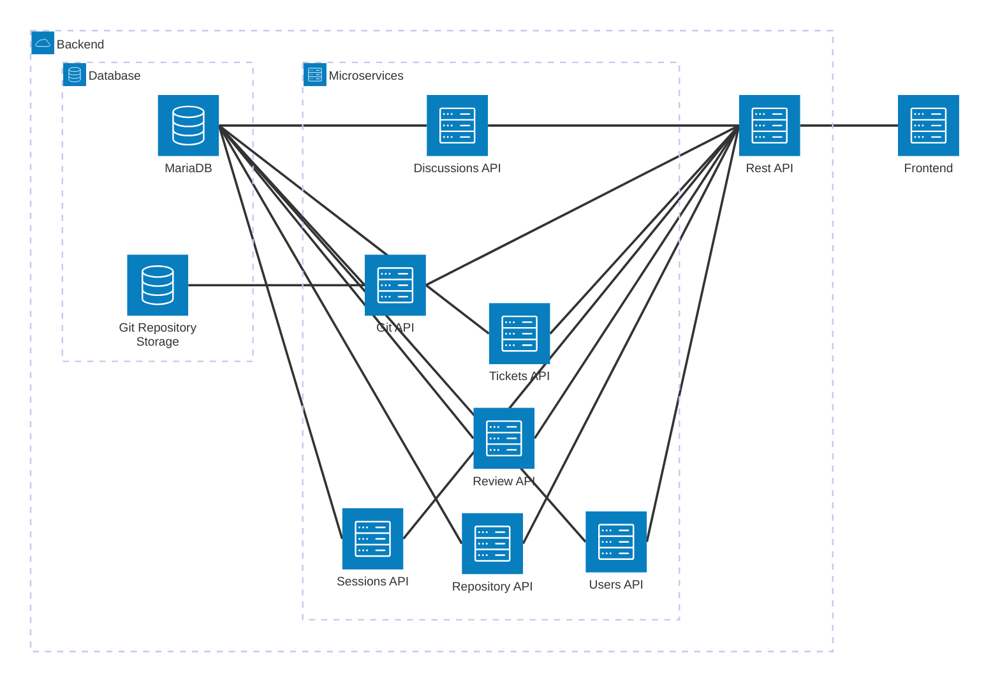

# Getting Started

## Architecture
Our app follows the [microservices architecture](https://www.geeksforgeeks.org/system-design/microservices/).

```mermaid
architecture-beta
    group backend(cloud)[Backend]
    group microservices(server)[Microservices] in backend
    
    service rest_api(server)[Rest API] in backend
    service users(server)[Users API] in microservices
    service repo(server)[Repository API] in microservices
    service git(server)[Git API] in microservices
    service sessions(server)[Sessions API] in microservices
    service review(server)[Review API] in microservices
    service tickets(server)[Tickets API] in microservices
    service disc(server)[Discussions API] in microservices

    group db_group(database)[Database] in backend
    service mariadb(database)[MariaDB] in db_group
    service git_storage(database)[Git Repository Storage] in db_group

    service frontend(server)[Frontend]

    frontend:L -- R:rest_api
    
    rest_api:L -- R:users
    rest_api:L -- R:repo
    rest_api:L -- R:git
    rest_api:L -- R:sessions
    rest_api:L -- R:review
    rest_api:L -- R:tickets
    rest_api:L -- R:disc

    users:L -- R:mariadb
    repo:L -- R:mariadb
    git:L -- R:mariadb
    sessions:L -- R:mariadb
    review:L -- R:mariadb
    tickets:L -- R:mariadb
    disc:L -- R:mariadb

    git:L -- R:git_storage
```